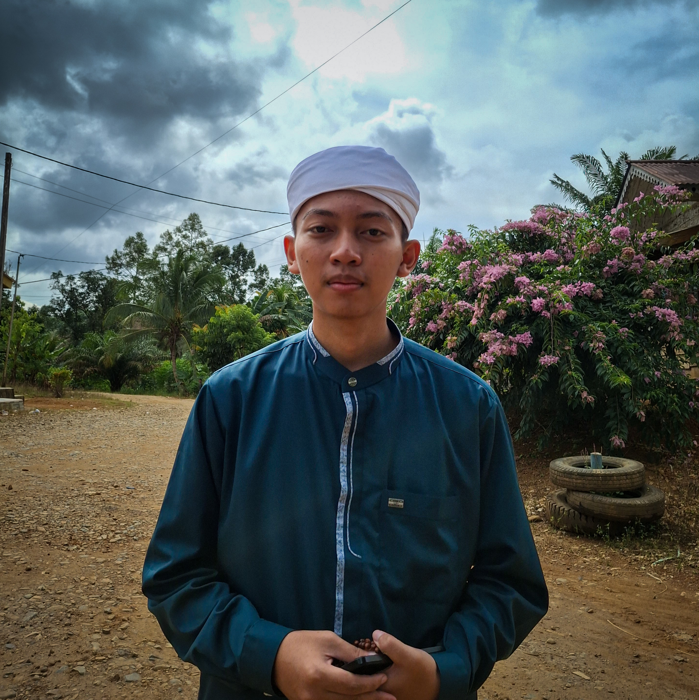
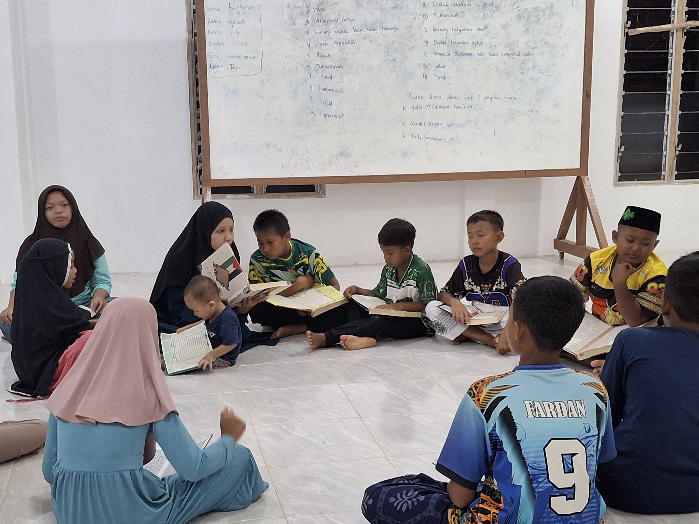
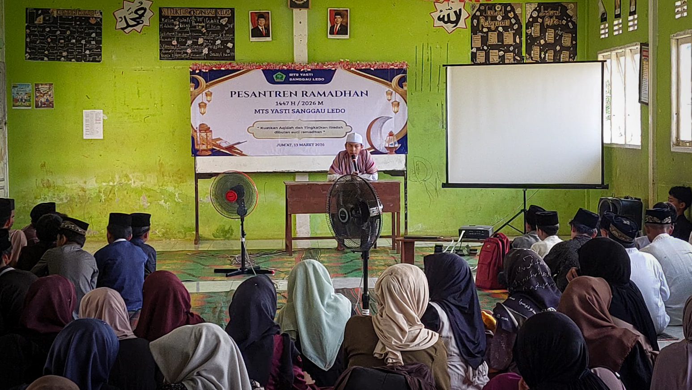

<!DOCTYPE html>
<html lang="id">
<head>
<meta charset="UTF-8">
<meta name="viewport" content="width=device-width, initial-scale=1.0">
<title>Pondok Pesantren Ziyadatul Ilmi</title>
<link rel="stylesheet" href="style.css">
<link rel="icon" type="image/png" href="logo pondok polos.png">
</head>
<body>

<nav class="navbar">
  

    
    Pondok Pesantren Ziyadatul Ilmi
  

  

    <a href="index.html">Home</a>
    <a href="pendidikan.html">Pendidikan</a>
    <a href="pendaftaran.html">Pendaftaran</a>
    <button class="toggle-btn" id="modeToggle">Mode</button>
  

</nav>

<section class="hero">
    

        <h1>Mencetak Generasi Qur'ani</h1>
        
Berilmu • Berakhlak • Berprestasi

    

</section>

<section class="section">
    

<h2>Tentang Pondok</h2>

Pondok Pesantren Ziyadatul Ilmi adalah Pondok Pesantren yang beraqidah Ahlussunnah Wal Jama'ah dan bermadzhab Syafi'i.

Berdirinya Pondok Pesantren ziyadatul Ilmu dengan tujuan untuk mencetak generasi yang memiliki ilmu serta kemampuan dalam berdakwah, 
    menyebarkan Aqidah Ahlussunnah Wal Jama'ah, serta bisa menguasai Fiqih dengan pemahaman ulama yang berbeda-beda

Pondok Pesantren Ziyadatul Ilmi Menawarkan program-program di antaranya ada :

<ul>
    <li>Program Tahfidz AlQur'an</li>
    Yaitu program yang fokus untuk menghafalkan Al-Qur'an dengan Program kurang dari 3 tahun selesai, dengan mengikuti program paket atau
    bersamaan kelas,jika ingin melanjutkan pendidikan, maka bisa melanjutkan ke pondok pesantren yang berada di pulau Jawa, yang bekerjasama
    dengan pihak pondok pesantren.
    <li>Perogram Salaf</li>
    Yaitu Program berbasis pendidikan salaf yang mendalami kitab dan memahaminya, serta bisa menguasai ilmu alat seperti: Nahwu, Sorof, Balaghoh,
    Bahasa Arab dan Mantiq.
</ul>

</section>

<section class="section">
    

<h2>Visi</h2>

Menjadi pesantren unggulan yang melahirkan generasi islami, cerdas dan berkarakter.

<h2>Misi</h2>
<ul>
<li>Menguatkan hafalan Al-Qur'an</li>
<li>Mengembangkan ilmu pengetahuan</li>
<li>Membentuk akhlak mulia</li>
</ul>
    

</section>

<section class="section">
    

 <h2 style="text-align:center; margin-bottom:40px;">Kegiatan Santri</h2>

    

        

            
            
Prestasi

        

        

            
            
Belajar Al-Qur'an

        

        

            
            
Diskusi Ilmiah

        

        

            
            
Foto Bersama

        

    

    

</section>

<!-- LIGHTBOX -->

    

<footer class="footer">
© 2026 Pondok Pesantren Ziyadatul Ilmi | All Rights Reserved
</footer>

</body>
</html>
